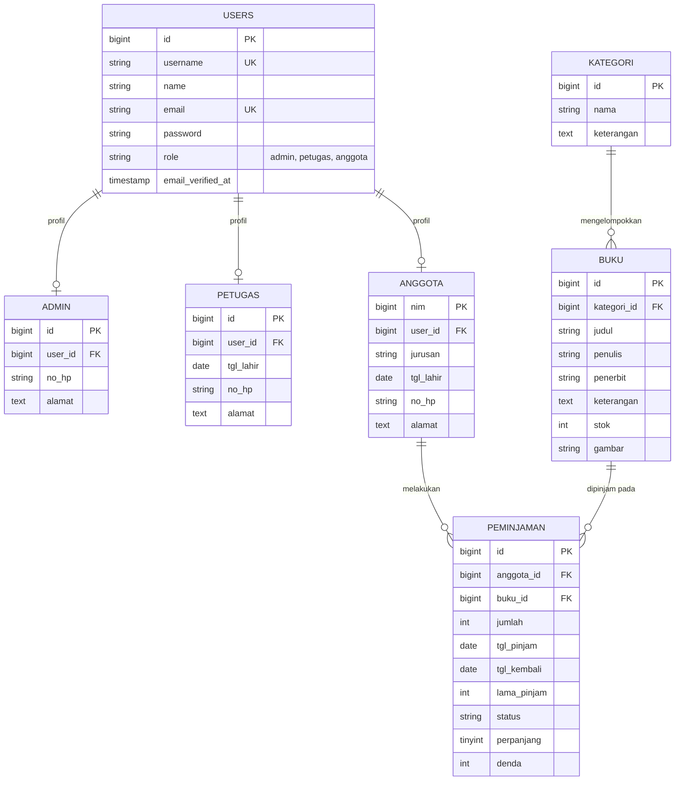
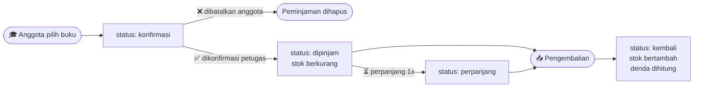

<div align="center">


# 📚 Polinema Library

**Sistem Informasi Perpustakaan berbasis web dengan 3 level pengguna — Admin, Petugas, dan Anggota.**
Mulai dari kelola koleksi buku, transaksi peminjaman & pengembalian, perhitungan denda otomatis, sampai cetak laporan bulanan dalam format PDF.

<br>

[](https://laravel.com)
[](https://php.net)
[](https://mysql.com)
[](https://adminlte.io)
[](https://getbootstrap.com)
[](#-testing)
[](https://github.com/laravel/laravel/blob/master/LICENSE)

<br>

[**✨ Fitur**](#-fitur-utama) &nbsp;•&nbsp;
[**🧱 Teknologi**](#-teknologi-yang-digunakan) &nbsp;•&nbsp;
[**🗂️ Database**](#️-struktur-database) &nbsp;•&nbsp;
[**🔄 Alur**](#-alur-peminjaman) &nbsp;•&nbsp;
[**⚙️ Instalasi**](#️-instalasi) &nbsp;•&nbsp;
[**🧪 Testing**](#-testing) &nbsp;•&nbsp;
[**🖼️ Screenshot**](#️-screenshot-aplikasi) &nbsp;•&nbsp;
[**🗺️ Roadmap**](#️-roadmap--saran-pengembangan)

</div>

---

## 📖 Tentang Proyek

**Polinema Library** adalah aplikasi perpustakaan digital yang dibangun dengan **Laravel 13** dan panel admin **AdminLTE 3**. Aplikasi ini dirancang untuk menggantikan pencatatan peminjaman buku yang masih manual, dengan alur kerja yang jelas antara petugas dan anggota perpustakaan.

<table>
<tr>
<td width="33%" align="center">

### 🔐
**Multi-Role Auth**

Tiga level akses dengan middleware terpisah, registrasi mandiri + verifikasi email

</td>
<td width="33%" align="center">

### 🔄
**Transaksi Lengkap**

Pinjam → konfirmasi → perpanjang → kembali, dengan denda otomatis

</td>
<td width="33%" align="center">

### 📊
**Laporan PDF**

Rekap peminjaman per bulan, siap cetak lewat DomPDF

</td>
</tr>
</table>

---

## ✨ Fitur Utama

### 🌐 Umum (semua pengguna)

| | Fitur | Keterangan |
|:--:|---|---|
| 🏠 | **Landing page** | Halaman publik dengan tombol login & register |
| 📝 | **Registrasi anggota** | Pendaftaran mandiri, otomatis berperan sebagai *anggota* |
| 📧 | **Verifikasi email** | Wajib verifikasi sebelum bisa mengakses dashboard |
| 🔑 | **Login fleksibel** | Bisa masuk dengan **username** maupun **email** |
| 👤 | **Profil & ganti password** | Setiap pengguna dapat memperbarui datanya sendiri |
| 🔔 | **Notifikasi interaktif** | Alert & konfirmasi menggunakan SweetAlert |

### 👑 Admin

| | Fitur | Keterangan |
|:--:|---|---|
| 🧑‍💼 | **CRUD Admin** | Kelola akun administrator + pencarian data |
| 🧑‍🏫 | **CRUD Petugas** | Kelola akun petugas perpustakaan + pencarian data |
| 🎓 | **CRUD Anggota** | Kelola data anggota (NIM, jurusan, kontak, alamat) |
| 🏷️ | **CRUD Kategori** | Pengelompokan koleksi buku |
| 📚 | **CRUD Buku** | Judul, penulis, penerbit, stok, dan sampul buku |
| 🔁 | **CRUD Peminjaman** | Kontrol penuh atas seluruh transaksi peminjaman |
| 🧾 | **Cetak laporan** | Laporan peminjaman per bulan dalam bentuk PDF |

### 🧑‍🏫 Petugas

| | Fitur | Keterangan |
|:--:|---|---|
| 🎓 | **CRUD Anggota** | Pendataan anggota perpustakaan |
| 🏷️ | **CRUD Kategori & Buku** | Pengelolaan koleksi perpustakaan |
| ✅ | **Konfirmasi peminjaman** | Menyetujui pengajuan pinjam dari anggota (stok otomatis berkurang) |
| ➕ | **Peminjaman langsung** | Input transaksi untuk anggota yang datang ke loket |
| ⏳ | **Perpanjangan** | Memperpanjang masa pinjam (maksimal 1×) |
| 📥 | **Pengembalian** | Hitung lama pinjam & denda otomatis, stok buku dikembalikan |
| 🧾 | **Cetak laporan** | Laporan peminjaman bulanan dalam bentuk PDF |

### 🎓 Anggota

| | Fitur | Keterangan |
|:--:|---|---|
| 📖 | **Katalog buku** | Menelusuri koleksi lengkap dengan sampul dan detail buku |
| 🛒 | **Ajukan peminjaman** | Pinjam buku langsung dari katalog (status awal: `konfirmasi`) |
| 📋 | **Riwayat peminjaman** | Memantau status, tanggal, dan denda tiap transaksi |
| ⏳ | **Ajukan perpanjangan** | Memperpanjang masa pinjam buku yang sedang dipinjam |
| ❌ | **Batalkan pengajuan** | Selama status masih `konfirmasi`, peminjaman bisa dibatalkan |
| 📅 | **Kalender & aturan** | Dashboard berisi kalender dan ringkasan aturan peminjaman |

---

## 🧱 Teknologi yang Digunakan

| Kategori | Teknologi | Versi |
|---|---|---|
| **Framework** | [Laravel](https://laravel.com) | `13.x` |
| **Bahasa** | PHP | `^8.3` |
| **Database** | MySQL / MariaDB | — |
| **UI Panel** | [AdminLTE 3](https://github.com/jeroennoten/Laravel-AdminLTE) — `jeroennoten/laravel-adminlte` | `3.16` |
| **Frontend** | Bootstrap, jQuery, SASS, Laravel Mix (Webpack) | `4.6` / `3.6` |
| **Autentikasi** | [Laravel UI](https://github.com/laravel/ui) — scaffolding + email verification | `4.6` |
| **Cetak PDF** | [DomPDF](https://github.com/barryvdh/laravel-dompdf) — `barryvdh/laravel-dompdf` | `3.1` |
| **Notifikasi** | [SweetAlert](https://github.com/realrashid/sweet-alert) — `realrashid/sweet-alert` | `7.3` |
| **Kalender** | FullCalendar | — |
| **Testing** | PHPUnit (SQLite in-memory), Faker | `12.5` |
| **Dev Tools** | Laravel Debugbar, IDE Helper, Laravel Pint | — |

---

## 🗂️ Struktur Database



---

## 🔄 Alur Peminjaman



### 📜 Aturan peminjaman

| Aturan | Ketentuan |
|---|---|
| ⏱️ Masa pinjam | **7 hari** |
| 🔁 Perpanjangan | **maksimal 1×** — total menjadi 14 hari |
| 💸 Denda keterlambatan | **Rp 2.000 / hari** untuk setiap judul buku |
| 🤝 Pembayaran denda | Dibayarkan langsung ke petugas saat pengembalian |
| 🧾 Konfirmasi | Pengajuan pinjam dari anggota harus dikonfirmasi petugas |

---

## ⚙️ Instalasi

### 📋 Prasyarat

- **PHP** `>= 8.3` (proyek ini dikembangkan di atas [Laragon](https://laragon.org))
- **Composer** `2.x`
- **MySQL / MariaDB**
- **Node.js & NPM** *(opsional — hanya jika ingin build ulang asset)*
- *(opsional)* Akun SMTP untuk mengirim email verifikasi sungguhan — secara default email ditulis ke `storage/logs/laravel.log`

### 🚀 Langkah-langkah

**1️⃣ Clone repository**

```bash
git clone https://github.com/Almasyriqi/Laravel_Web_Perpustakaan.git
cd Laravel_Web_Perpustakaan
```

**2️⃣ Install dependency**

```bash
composer install
npm install        # opsional
```

**3️⃣ Siapkan file environment**

```bash
cp .env.example .env
php artisan key:generate
```

**4️⃣ Buat database baru** di phpMyAdmin (misalnya `perpustakaan`), lalu sesuaikan `.env`:

```env
DB_CONNECTION=mysql
DB_HOST=127.0.0.1
DB_PORT=3306
DB_DATABASE=perpustakaan     # sesuaikan nama database Anda
DB_USERNAME=root             # sesuaikan username database
DB_PASSWORD=                 # sesuaikan password database
```

**5️⃣ Atur email verifikasi.** Secara default `MAIL_MAILER=log`, sehingga tautan verifikasi akun baru bisa disalin dari `storage/logs/laravel.log` tanpa perlu SMTP. Untuk mengirim email sungguhan, ganti ke SMTP:

<details>
<summary>📮 <b>Konfigurasi Mailtrap</b> — direkomendasikan untuk development</summary>

<br>

```env
MAIL_MAILER=smtp
MAIL_HOST=smtp.mailtrap.io
MAIL_PORT=2525
MAIL_USERNAME=your_mailtrap_username
MAIL_PASSWORD=your_mailtrap_password
MAIL_SCHEME=smtp                 # STARTTLS otomatis di port 587; gunakan smtps untuk port 465
MAIL_FROM_ADDRESS=no-reply@polinemalibrary.test
MAIL_FROM_NAME="${APP_NAME}"
```

Panduan lengkap: [Laravel Kirim Email dengan Mailtrap](https://ilmucoding.com/laravel-kirim-email-mailtrap/)

</details>

<details>
<summary>✉️ <b>Konfigurasi Gmail SMTP</b></summary>

<br>

```env
MAIL_MAILER=smtp
MAIL_HOST=smtp.gmail.com
MAIL_PORT=587
MAIL_USERNAME=email_anda@gmail.com
MAIL_PASSWORD=app_password_gmail    # gunakan App Password, bukan password akun
MAIL_SCHEME=smtp                 # STARTTLS otomatis di port 587; gunakan smtps untuk port 465
MAIL_FROM_ADDRESS=email_anda@gmail.com
MAIL_FROM_NAME="${APP_NAME}"
```

> ⚠️ Gunakan **App Password** dari akun Google yang sudah mengaktifkan 2FA, dan **jangan pernah commit file `.env`** ke repository.

</details>

**6️⃣ Migrasi & isi data awal**

```bash
php artisan migrate --seed
```

**7️⃣ Jalankan test** *(opsional, tidak butuh database — memakai SQLite in-memory)*

```bash
php artisan test
```

**8️⃣ Jalankan aplikasi** 🎉

```bash
php artisan serve
```

Buka browser ke **<http://127.0.0.1:8000>** — selamat mencoba! 😉

---

## 🔑 Akun Default (hasil seeder)

| Role | Username | Password | Hak akses |
|:--:|---|---|---|
| 👑 **Admin** | `admin` | `12345678` | Akses penuh ke seluruh modul |
| 🧑‍🏫 **Petugas** | `petugas` | `12345678` | Transaksi & pengelolaan koleksi |
| 🎓 **Anggota** | `almasyriqi` | `12345678` | Katalog & peminjaman buku |

> 💡 Seeder juga membuat **20 user + data anggota** dan **50 buku** dummy melalui Faker, sehingga aplikasi langsung berisi data untuk diuji coba.
>
> 🔒 Akun di atas hanya untuk lingkungan development — **ganti seluruh kredensial sebelum digunakan secara nyata.**

---

## 🖼️ Screenshot Aplikasi

<details open>
<summary><b>🌐 Halaman Umum</b></summary>

<br>

| Landing Page | Login |
|:--:|:--:|
|  |  |
| Halaman publik sebelum masuk | Login dengan **username atau email** |

| Registrasi | Verifikasi Email |
|:--:|:--:|
|  |  |
| Pendaftaran anggota baru | Wajib verifikasi sebelum dapat mengakses dashboard |

</details>

<details>
<summary><b>👑 Dashboard Admin</b></summary>

<br>

| Home Admin | Profil |
|:--:|:--:|
|  |  |

| Ganti Password | Data Admin |
|:--:|:--:|
|  |  |

| Data Petugas | Data Anggota |
|:--:|:--:|
|  |  |

| Kategori Buku | Data Buku |
|:--:|:--:|
|  |  |

| Detail Buku | Data Peminjaman |
|:--:|:--:|
|  |  |

| Cetak Laporan Bulanan | |
|:--:|:--|
|  | Laporan peminjaman difilter per bulan, lalu dicetak sebagai PDF |

</details>

<details>
<summary><b>🧑‍🏫 Dashboard Petugas</b></summary>

<br>

| Home Petugas | Profil |
|:--:|:--:|
|  |  |

| Ganti Password | Data Anggota |
|:--:|:--:|
|  |  |

| Kategori Buku | Data Buku |
|:--:|:--:|
|  |  |

| Detail Buku | Transaksi Peminjaman |
|:--:|:--:|
|  |  |
| | Petugas dapat memperpanjang & menerima pengembalian buku |

| Konfirmasi Peminjaman | Cetak Laporan |
|:--:|:--:|
|  |  |
| Menyetujui pengajuan pinjam dari anggota | Rekap peminjaman bulanan dalam PDF |

</details>

<details>
<summary><b>🎓 Dashboard Anggota</b></summary>

<br>

| Home Anggota | Profil |
|:--:|:--:|
|  |  |
| Berisi kalender dan aturan peminjaman | Anggota dapat memperbarui datanya sendiri |

| Ganti Password | Katalog Buku |
|:--:|:--:|
|  |  |

| Detail Buku | Form Peminjaman |
|:--:|:--:|
|  |  |

| Riwayat Peminjaman | |
|:--:|:--|
|  | Peminjaman dapat dibatalkan selama status masih `konfirmasi` |

</details>

---

## 🧪 Testing

Test berjalan di **SQLite in-memory** (lihat `phpunit.xml`), jadi tidak menyentuh database MySQL Anda.

```bash
php artisan test                 # seluruh suite
php artisan test --filter=Peminjaman   # hanya alur peminjaman
vendor/bin/pint --dirty          # rapikan format file yang berubah
```

| Suite | Cakupan |
|---|---|
| `SmokeTest` | Halaman utama tiap role dapat dirender, middleware role menolak akses silang |
| `AuthTest` | Login via username/email, logout `POST`, verifikasi email, registrasi |
| `PeminjamanFlowTest` | Ajukan → konfirmasi → perpanjang → kembali, stok, denda, pembatalan, edit admin |
| `LaporanTest` | Filter bulan + tahun, validasi periode, keluaran PDF |
| `ValidationTest` | Duplikat username/email, profil orang lain, jumlah/status tidak valid |
| `PeminjamanServiceTest` | Unit test perhitungan denda dan lama pinjam |

---

## 🗺️ Roadmap & Saran Pengembangan

Beberapa hal yang layak dikerjakan berikutnya, diurutkan berdasarkan prioritas.

### 🔴 Prioritas Tinggi — keamanan & fondasi

- [x] **Upgrade ke Laravel 13 + PHP 8.3** — target dinaikkan dari 11 ke 13 karena Laravel 11 sudah *end-of-life* sejak Maret 2026; struktur aplikasi mengikuti skeleton ramping Laravel 11+
- [x] **Logout hanya lewat route `POST`** dengan CSRF token; verifikasi email diaktifkan kembali
- [x] **Filter laporan per bulan dan tahun** (`whereMonth` + `whereYear`, pemilih tahun di halaman laporan)
- [x] **Mutasi stok dalam DB transaction + `lockForUpdate`** lewat `App\Services\PeminjamanService` — sekaligus memperbaiki stok yang bergeser saat admin mengedit dan anggota yang bisa membatalkan peminjaman orang lain
- [x] **Validasi lewat Form Request** — rule `unique:users` kini benar-benar dieksekusi, edit meng-*ignore* data sendiri
- [x] **Automated test PHPUnit** — 53 test (auth, akses per role, alur pinjam → konfirmasi → perpanjang → kembali → denda, laporan, validasi); jalankan dengan `php artisan test`

### 🟡 Prioritas Menengah — kualitas kode

- [ ] Ganti *raw join* berulang dengan **Eloquent relationship + eager loading** (`with()`) untuk menghindari N+1 query
- [ ] Pindahkan logika **denda & lama pinjam** dari controller ke *service class*, dan jadikan tarif denda sebagai nilai konfigurasi
- [ ] Simpan sampul buku lewat **Storage disk** (`storage:link`) — path penghapusan file lama saat ini belum tepat
- [ ] Tambahkan kolom **`tgl_harus_kembali`**, `timestamps`, serta **index** pada kolom `status` dan `tgl_pinjam`
- [ ] Terapkan **soft delete** pada buku & anggota agar riwayat peminjaman tetap utuh
- [ ] Pertimbangkan **Policy/Gate** atau `spatie/laravel-permission` menggantikan tiga middleware role terpisah

### 🟢 Nice to Have — fitur baru

- [ ] 🔍 **Pencarian & filter katalog** untuk anggota (judul, penulis, kategori)
- [ ] 📧 **Notifikasi email jatuh tempo** otomatis via Queue + Task Scheduler
- [ ] 📊 **Dashboard statistik** — buku terpopuler, tren peminjaman, daftar keterlambatan
- [ ] 📑 **Export laporan ke Excel** selain PDF, plus filter rentang tanggal bebas
- [ ] 🔖 **Barcode / QR code** buku dan kartu anggota untuk mempercepat transaksi loket
- [ ] ⭐ **Rating & ulasan buku** serta fitur *booking* buku yang stoknya sedang habis
- [ ] 🌓 **Dark mode** dan penyempurnaan tampilan mobile
- [ ] 🤖 **CI/CD GitHub Actions** — menjalankan Laravel Pint + test otomatis di setiap push
- [ ] 🧹 **Bersihkan Laravel Mix** — asset tidak pernah dikompilasi (CSS/JS statis di `public/`); hapus `package.json`/`webpack.mix.js` atau ganti ke Vite

---

## 👥 Tim Pengembang

| NIM | Nama | GitHub |
|---|---|---|
| `1941720057` | Muhammad Syifa'ul Ikrom Almasyriqi | [@Almasyriqi](https://github.com/Almasyriqi) |
| `1941720171` | Muhammad Fauzan | [@fauzanmuh](https://github.com/fauzanmuh) |

> 🎓 Proyek ini dikerjakan sebagai **Tugas Besar mata kuliah Pemrograman Web Lanjut** — Teknik Informatika, Politeknik Negeri Malang.

---

## 📄 Lisensi

Dirilis di bawah lisensi **MIT**, mengikuti lisensi framework [Laravel](https://github.com/laravel/laravel/blob/master/LICENSE).

<div align="center">

<br>

**Kalau proyek ini bermanfaat, jangan lupa beri ⭐ pada repository ini!**

Dibuat dengan ❤️ dan ☕ menggunakan [Laravel](https://laravel.com)

</div>
